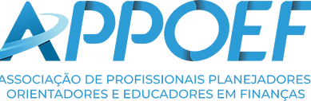

# FECAP - Fundação de Comércio Álvares Penteado

# Projeto APPOEF

## Financeiras em Código

## Integrantes: <a href="https://www.linkedin.com/in/sabrinna-vicente-049225306/">Sabrinna Cristina Gomes Vicente</a>, <a href="https://www.linkedin.com/in/beatriz-r-177976252/">Beatriz de Souza Santos Rio Branco</a>, <a href="https://www.linkedin.com/in/jenifer-barreto-55022523b/">Jenifer Barreto</a>, <a href="https://www.linkedin.com/in/mariaeflopes/">Maria Eduarda de Freitas Lopes</a>
## Professores Orientadores: <a href="https://www.linkedin.com/in/victorbarq/">Victor Rosetti</a>, <a href="https://www.linkedin.com/in/vheltai/">Vinicius Heltai</a>

## Descrição

Nosso projeto se trata de um aplicativo focado na ODS 4 (Emprego Digno e Crescimento Ecônomico), que visa oferecer educação financeira de fácil acesso para todos, possibilitando que todas as pessoas possam aprender a gerir melhor seu dinheiro, com dicas sobre como economizar, investir e cuidar de suas finanças pessoais. 

<a>
A nossa proposta é contribuir para uma educação financeira inclusiva, proporcionando conhecimento prático para que todos os grupos de pessoas possam tomar decisões financeiras mais conscientes, alcançando uma melhor qualidade de vida e sustentabilidade econômica, impactando assim a relação das pessoas com suas finanças e a falta de acesso fácil a esse tipo de conhecimento essencial.
</a>

## Links 
<a href="https://www.figma.com/design/oqu6D8AnsQO9fFDGpQdWX3/APOEF?node-id=0-1&node-type=canvas&t=Ly7hNgtEdeeizgr8-0">Figma</a>

<a href="https://www.appoef.org/">APPOEF</a>

